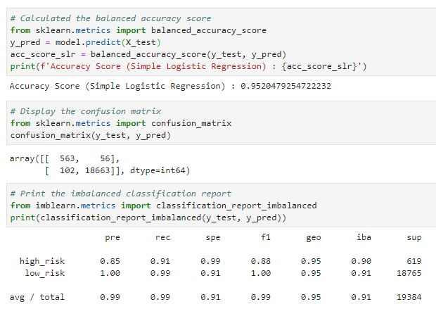
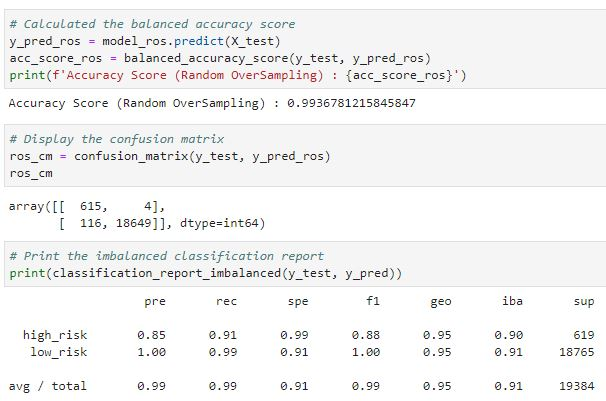
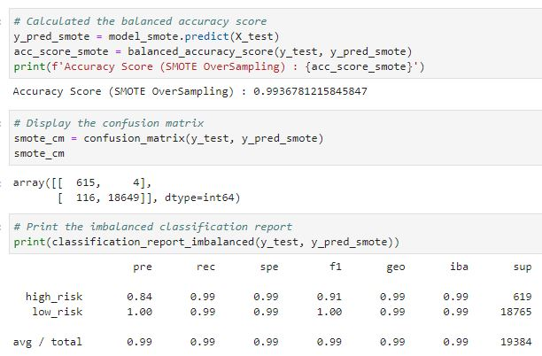
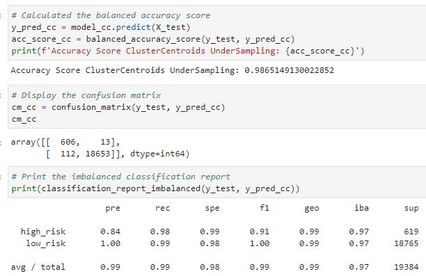
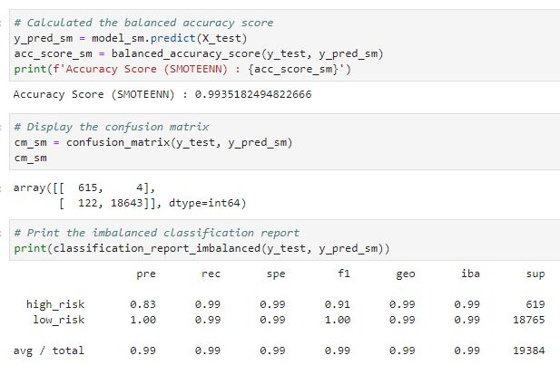
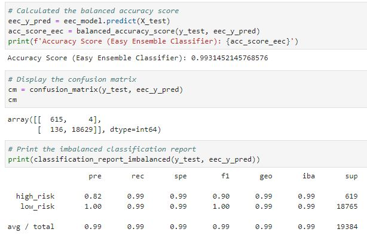
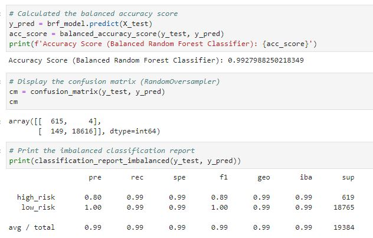

# Risky Business

## Background

Mortgages, student and auto loans, and debt consolidation are just a few examples of credit and loans that people seek online. Peer-to-peer lending services such as Loans Canada and Mogo let investors loan people money without using a bank. However, because investors always want to mitigate risk, a client has asked that you help them predict credit risk with machine learning techniques.

In this assignment you will build and evaluate several machine learning models to predict credit risk using data you'd typically see from peer-to-peer lending services. Credit risk is an inherently imbalanced classification problem (the number of good loans is much larger than the number of at-risk loans), so you will need to employ different techniques for training and evaluating models with imbalanced classes. You will use the imbalanced-learn and Scikit-learn libraries to build and evaluate models using the two following techniques:

1. [Resampling](#Resampling)
2. [Ensemble Learning](#Ensemble-Learning)

- - -

### Files

[Resampling Starter Notebook](Starter_Code/credit_risk_resampling.ipynb)

[Ensemble Starter Notebook](Starter_Code/credit_risk_ensemble.ipynb)

[Lending Club Loans Data](Instructions/Resources/LoanStats_2019Q1.csv.zip)

- - -

#### Resampling

Use the [imbalanced learn](https://imbalanced-learn.readthedocs.io) library to resample the LendingClub data and build and evaluate logistic regression classifiers using the resampled data.

You need to:

1. Oversample the data using the `Naive Random Oversampler` and `SMOTE` algorithms.

2. Undersample the data using the `Cluster Centroids` algorithm.

3. Over- and undersample using a combination `SMOTEENN` algorithm.

For each of the above, you will need to:

1. Train a `logistic regression classifier` from `sklearn.linear_model` using the resampled data.

2. Calculate the `balanced accuracy score` from `sklearn.metrics`.

3. Calculate the `confusion matrix` from `sklearn.metrics`.

4. Print the `imbalanced classification report` from `imblearn.metrics`.

## Accuracy Score, confusion matrix, and classification report for simple logistic regression

## Accuracy Score, confusion matrix, and classification report for random_oversampling

## Accuracy Score, confusion matrix, and classification report for smote_oversampling

## Accuracy Score, confusion matrix, and classification report for undersampling

## Accuracy Score, confusion matrix, and classification report for Combination (smoteenn)

Use the above to answer the following questions:

## Which model had the best balanced accuracy score?
* Naive Random and SMOTE Oversampling had the best balanced accuracy score of  0.9936781215845847

## Which model had the best recall score?
* SMOTE oversampling, Random Oversampling, and Combination (SMOTEENN) had the best recall score.

## Which model had the best geometric mean score?
* Random Oversampling, SMOTE oversampling, ClusterCentroids UnderSampling and SMOTEENN have the best geometric mean score of 0.99

#### Ensemble Learning

In this section, you will train and compare two different ensemble classifiers to predict loan risk and evaluate each model. You will use the [Balanced Random Forest Classifier](https://imbalanced-learn.readthedocs.io/en/stable/generated/imblearn.ensemble.BalancedRandomForestClassifier.html#imblearn-ensemble-balancedrandomforestclassifier) and the [Easy Ensemble Classifier](https://imbalanced-learn.readthedocs.io/en/stable/generated/imblearn.ensemble.EasyEnsembleClassifier.html#imblearn-ensemble-easyensembleclassifier). Refer to the documentation for each of these to read about the models and see examples of the code.

Complete the following steps for each model:

1. Train the model using the quarterly data from LendingClub provided in the `Resource` folder.

2. Calculate the balanced accuracy score from `sklearn.metrics`.

3. Print the confusion matrix from `sklearn.metrics`.

4. Generate a classification report using the `imbalanced_classification_report` from imbalanced learn.

5. For the balanced random forest classifier only, print the feature importance sorted in descending order (most important feature to least important) along with the feature score.

## Accuracy Score, confusion matrix, and classification report for easy ensemble classifier

## Accuracy Score, confusion matrix, and classification report for Balanced Random Forest Classifier

Use the above to answer the following questions:

## Which model had the best balanced accuracy score?
* Easy Ensemble Classifier had the best balanced accuracy score of 0.9931452145768576

## Which model had the best recall score?
* Both Balanced Random Forest Classifier and Easy Ensemble Classifier had the best recall score of 0.99

## Which model had the best geometric mean score?
* Both Balanced Random Forest Classifier and Easy Ensemble Classifier had the best geometric mean score of 0.99

## What are the top three features?
* The top three features are :
1) Borrower Income - 0.21788480603139448
2) Interest Rate - 0.19595880072166166
3) Debt to income - 0.1770964986362893

- - -

© 2020 Trilogy Education Services, a 2U, Inc. brand. All Rights Reserved.
